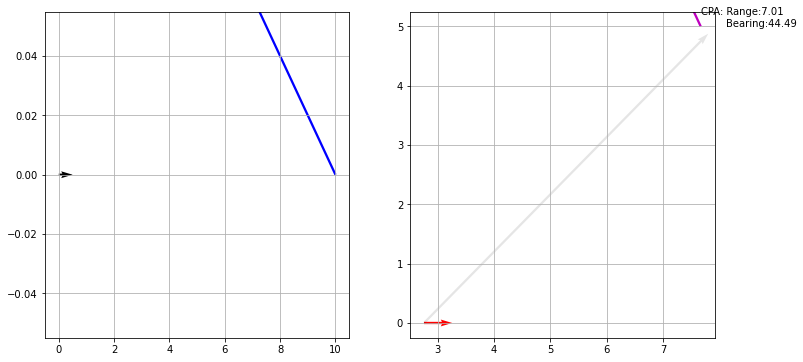

```python
import Vessel
import matplotlib.pyplot as plt
```

First lets define two vessels with parameters shown below.


```python
v1 = vessel.Vessel(length=5,
                  x = 0,
                  y = 0,
                  speed = 5,
                  heading = 90)

v2 = vessel.Vessel(length=5,
                  x = 10,
                  y = 0,
                  speed = 10,
                  heading = 335)

v1.print()
v2.print()
```

    Vessel:
       pos:			0.000,0.000
       speed:			5.000
       heading:			90.000
       V:			5.000,0.000
    
    Vessel:
       pos:			10.000,0.000
       speed:			10.000
       heading:			335.000
       V:			-4.226,9.063
    


Now we can calculate the CPA of vessel 2 relative to vessel 1 like this:


```python
(tcpa,Vesselcpa,OScpa,Rcpa,Bcpa) = v1.cpa(v2)
```


```python
print("Time to CPA: %0.3f" % tcpa)
print("Location of Vessel at CPA: %0.3f, %0.3f" % (Vesselcpa[0],Vesselcpa[1]))
print("Location of Own Ship at CPA (v1): %0.3f, %0.3f" % (OScpa[0],OScpa[1]))
print("Range at CPA: %0.3f" % Rcpa)
print("Bearing of Vessel 2 from Own Ship at CPA: %0.3f" % Bcpa)
```

    Time to CPA: 0.552
    Location of Vessel at CPA: 7.669, 4.999
    Location of Own Ship at CPA (v1): 2.758, 0.000
    Range at CPA: 7.008
    Bearing of Vessel 2 from Own Ship at CPA: 44.489


We can also plot the two vessel's locations now, and their locations at CPA with a vector from Own Ship to the other vessel at CPA indicating the range and bearing. 

This is a work in progress. The scaling of these plots is not right.


```python
plt.show(v1.plotcpa(v2))
```





```python

```


```python

```
